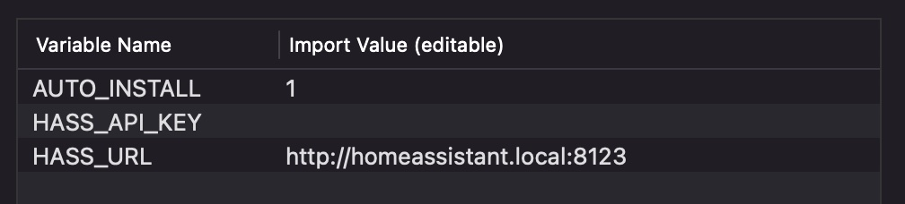
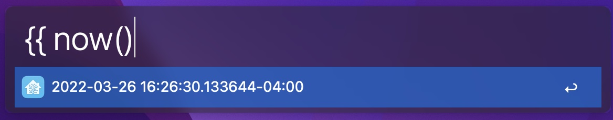
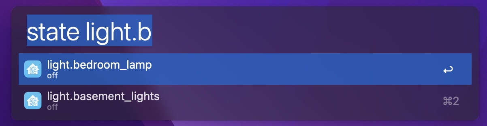
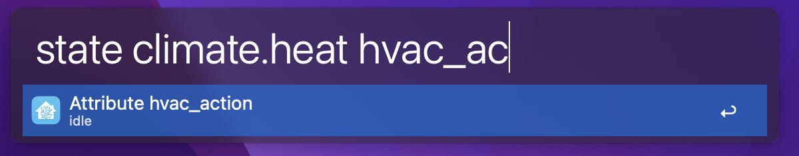

# Home Assistant Alfred workflow

This is a little set of scripts I developed to monitor my [Home Assistant][] instance with [Alfred][]. It's by no means a complete toolset, but it does have some helpful stuff.

---

## Installation

### Download directly from releases

I will eventually make a release on GitHub that you can download and open directly in Alfred.

The workflow will automatically install any dependencies (see [First Run](#first-run)). This means that the first time you run the workflow, it may take a minute to see results.

### Clone and build

The code can also be cloned and installed with `make install`. This will create the workflow, and open it with Alfred.

---

## Configuring the workflow

### Variables

In order to connect to Home Assistant, you need to set your URL and API key.

The URL is the same URL you use to access Home Assistant. Make sure to set the protocol as well (i.e. `http` or `https`), though you should not add a path. It defaults to `http://homeassistant.local:8123`. If you have a custom domain with SSL, you would use `https://myhass.custom.domain`.

To get your API key, you need to create one from your profile in Home Assistant:

You will set these in the environment variables of the workflow when you install it. You can also change the variables later by clicking the  variables icon in the workflow.

If you do not set these, your workflow will not be able to connect.

### First run

This workflow is written in Python and depends on a third-party module, [aiohttp][], to make the requests. By default, it uses a [shim](python) that manages creating a Python environment and installing dependencies when the workflow is run for the first time. This means you don't need to take any additional steps, but it does also mean the first time you run the workflow, you won't see anything happening for a bit. 

This only needs to happen once. When you run *any* of the workflow actions in the future, it should use this virtual environment automatically.

---

## Using the workflow

Right now, there are two scripts in the workflow: templates and states.

Neither of these scripts are connected to any output. You're more than welcome to alter the workflow and connect them to an output.

### Templates

**Syntax**: `{{ {template}`

The template script filter, triggered with `{{`, allows you to write templates and see their output in Alfred.

The script automatically inserts a `{{` at the beginning and a `}}` at the end (if one is needed).

### States

**Syntax**: `state [{entity}] [{attribute}]`

This script loads states from Home Assistant, and allows you to filter states by entity ID. 

If you provide the full entity ID, or there is only one result, the workflow displays all of the state attributes for the entity. You can filter state attributes by their name with a third argument.

